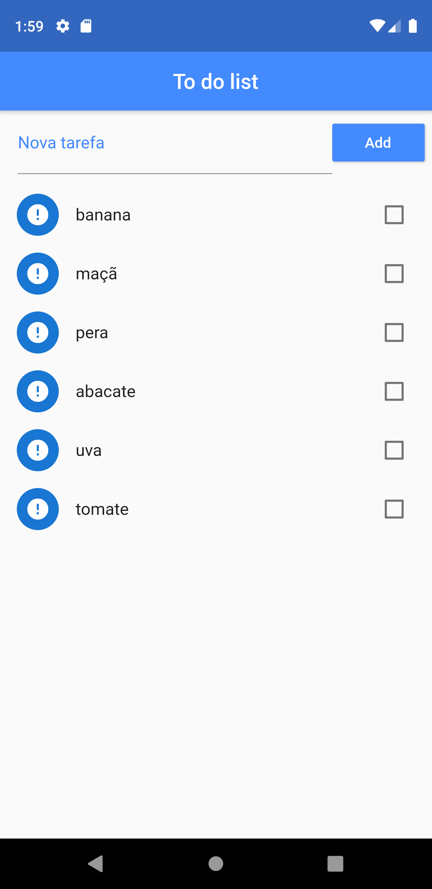
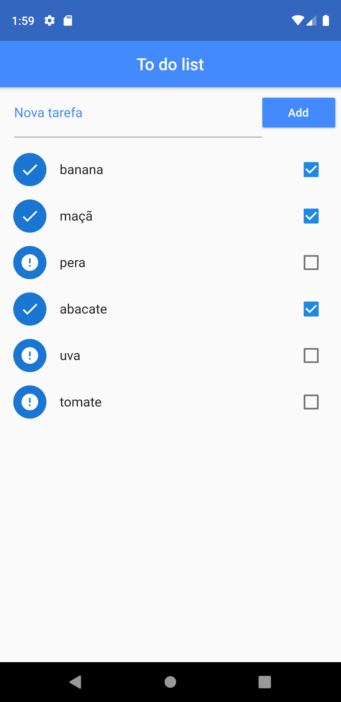
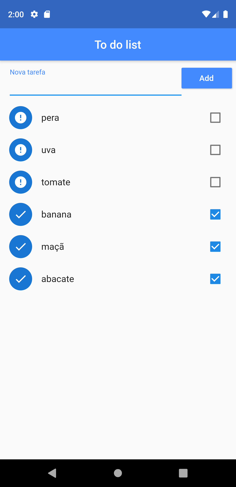
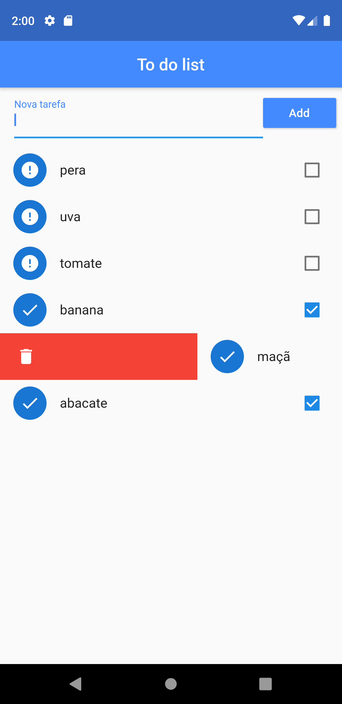
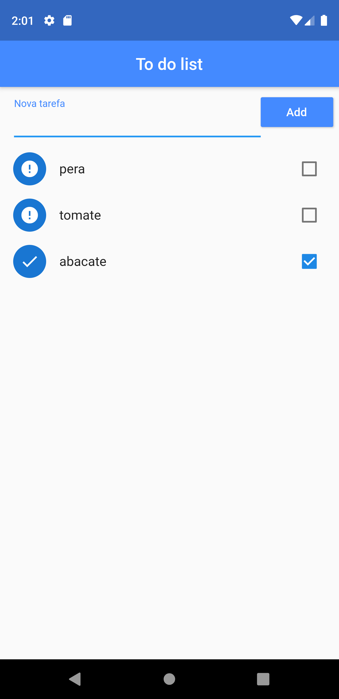

<h1 align="center">
    ToDoList
</h1>

# 📋 Resumo
Aplicação relizada com fim de treinar as habilidades com Flutter. Com isso, obtive os seguintes resultados: conhecimento de novos widgets, aprendizado de como armazenar dados no aplicativo, melhoramento na utilização de mapas, utilização de dados no futuro, etc.  

# 📖 Dados do projeto
Projeto em Flutter para aprendizado da ferramenta.  
Plugins utilizados: cupertino_icons: ^0.1.2 e path_provider: ^1.6.5 
Versão do Fluttere: 1.0.0+1  

# 🖼 Screenshots
Imagem 1 (Alguns itens adicionados); 
Imagem 2 (Alguns itens marcados antes de ordenar); 
Imagem 3 (Alguns itens marcados depois de ordenar); 
Imagem 4 (Um item sendo removido); 
Imagem 5 (Alguns itens depois de algumas remoções). 
Imagem 6 (Botão "desfazer" para voltar o último item removido);  

                                
