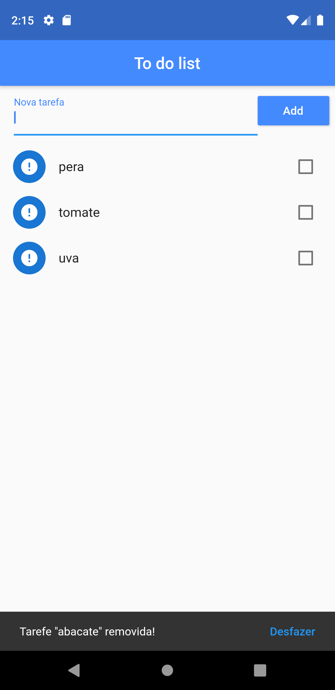

<h1 align="center">
    ToDoList
</h1>

# 📋 ABSTRACT
<strong>English: </strong>Application developed to train skills with the Flutter. With that, I got the following results: knowledge of new widgets, learning to store data in the application, improvement in the use of maps, use of data in the future, etc.   
<strong>Português: </strong>Aplicação relizada com fim de treinar as habilidades com Flutter. Com isso, obtive os seguintes resultados: conhecimento de novos widgets, aprendizado de como armazenar dados no aplicativo, melhoramento na utilização de mapas, utilização de dados no futuro, etc.   

# 📖 PROJECT DATA
Flutter project to learn the tool.  
Plugins: cupertino_icons: ^0.1.2 and path_provider: ^1.6.5 
Flutter version: 1.0.0+1  

# 🖼 SCREENSHOTS
Image 1 (Some items added); 
Image 2 (Some items checked before ordering); 
Image 3 (Some items checked after ordering); 
Image 4 (An item being removed); 
Image 5 (Some items after some removals). 
Image 6 (Undo button to return the last item removed);  

                                
